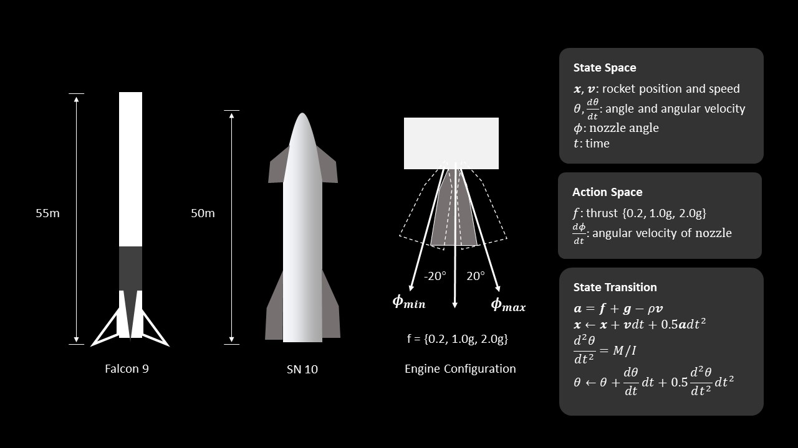
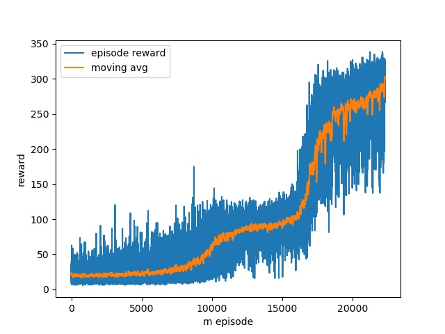
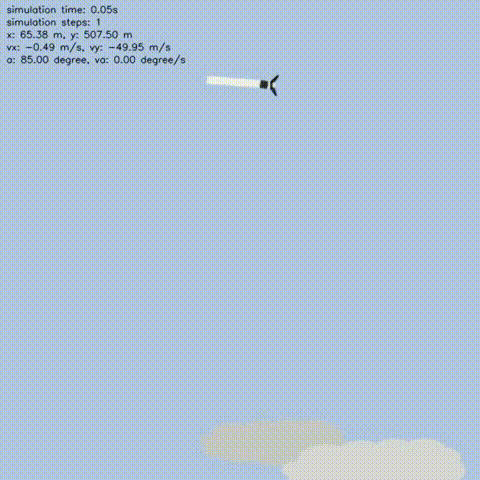

# Rocket-recycling with Reinforcement Learning

## One-min demo video

[](https://www.youtube.com/watch?v=gsIiniJMr3E)


## About this project

Driven by my admiration for SpaceX and a lifelong rocket fascination, I've embarked on an odyssey uniting virtual rocketry with cutting-edge innovation. Can the fusion of virtual rocket crafting and reinforcement learning decode rocket recycling? With dreams of my own rocket venture, I'm sculpting intricate digital rocket avatars, honing designs free from physical restraints. This journey extends to the heart of space exploration: recycling rockets for sustainability. By applying reinforcement learning, I aim to empower virtual rockets to autonomously return to Earth, reshaping rocket refurbishment




For the landing task, I followed the basic parameters of the Starship SN10 belly flop maneuver. The initial speed is set to -50m/s. The rocket orientation is set to 90 degrees (horizontally). The landing burn height is set to 500 meters above the ground. 


The reward functions are quite straightforward.

For the hovering tasks: the step-reward is given based on two rules: 1) The distance between the rocket and the predefined target point - the closer they are, the larger reward will be assigned. 2) The angle of the rocket body (the rocket should stay as upright as possible)

For the landing task: we look at the Speed and angle at the moment of contact with the ground - when the touching-speed are smaller than a safe threshold and the angle is close to 0 degrees (upright), we see it as a successful landing and a big reward will be assigned. The rest of the rules are the same as the hovering task.


I implement the above environment and train a policy-based agent (actor-critic) to solve this problem. The episode reward finally converges very well after over 20000 training episodes.

| Fully trained agent (task: hovering) |        Reward over number of episodes        |
| :----------------------------------: | :------------------------------------------: |
|              |  |


| Fully trained agent (task: landing) |        Reward over number of episodes        |
| :----------------------------------: | :------------------------------------------: |
|              |  |


Despite the simple setting of the environment and the reward, the agent has learned the belly flop maneuver nicely. The following animation shows a comparison between the real SN10 and a fake one learned from reinforcement learning.


## Requirements

See [Requirements.txt](Requirements.txt).


## Usage

To train an agent, see `./example_train.py`

To test an agent:

```python
import torch
from rocket import Rocket
from policy import ActorCritic
import os
import glob

# Decide which device we want to run on
device = torch.device("cuda:0" if torch.cuda.is_available() else "cpu")

if __name__ == '__main__':

    task = 'hover'  # 'hover' or 'landing'
    max_steps = 800
    ckpt_dir = glob.glob(os.path.join(task+'_ckpt', '*.pt'))[-1]  # last ckpt

    env = Rocket(task=task, max_steps=max_steps)
    net = ActorCritic(input_dim=env.state_dims, output_dim=env.action_dims).to(device)
    if os.path.exists(ckpt_dir):
        checkpoint = torch.load(ckpt_dir)
        net.load_state_dict(checkpoint['model_G_state_dict'])

    state = env.reset()
    for step_id in range(max_steps):
        action, log_prob, value = net.get_action(state)
        state, reward, done, _ = env.step(action)
        env.render(window_name='test')
        if env.already_crash:
            break
```


  publisher = {GitHub},
  journal = {GitHub repository},
  howpublished = {\url{https://github.com/jiupinjia/rocket-recycling}}
}
``````
